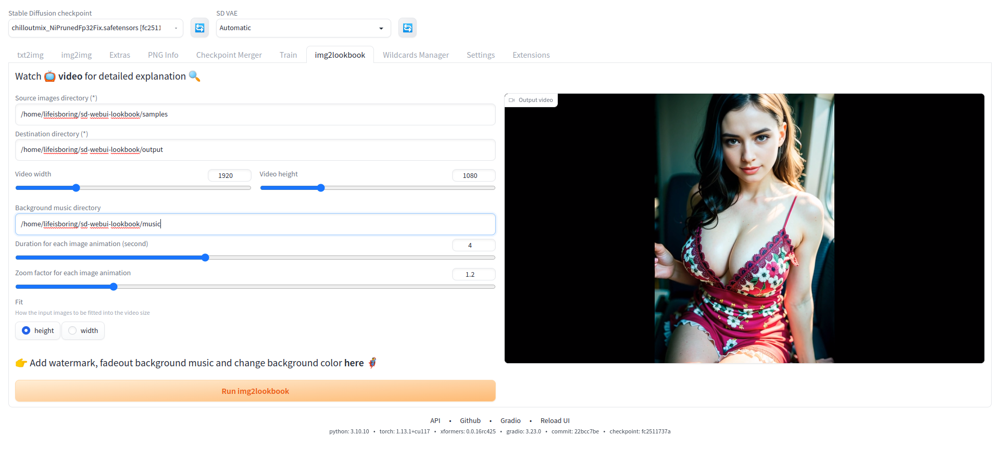
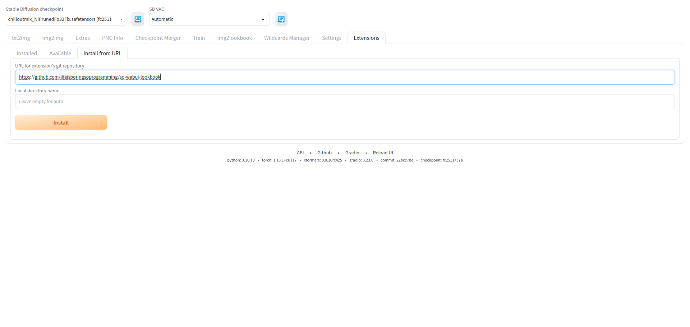
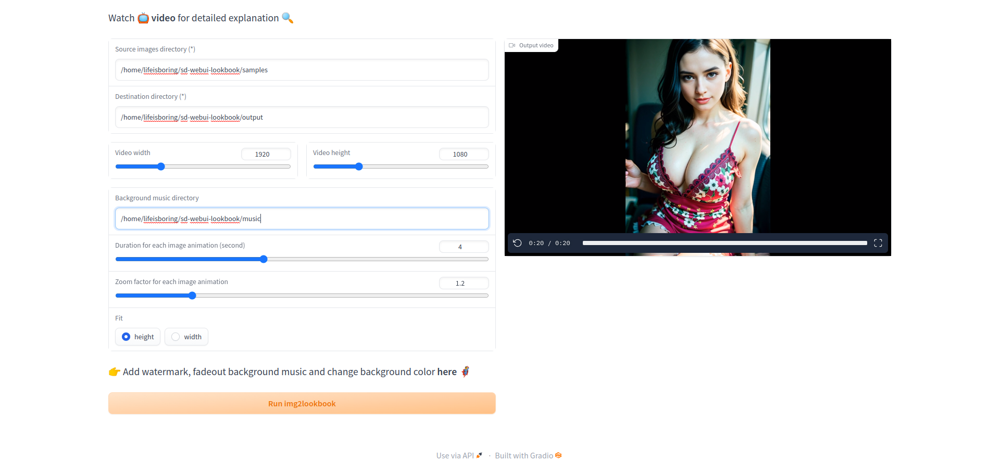

# Stable Diffusion Image 2 Video lookbook extension
A custom extension for [AUTOMATIC1111/stable-diffusion-webui](https://github.com/AUTOMATIC1111/stable-diffusion-webui) that create a video lookbook in different size from images with background music.

# Overview
* This project allows users to create a video lookbook from a set of images.
* With background music of their choice. 
* The output video can be saved to a specified folder. 
* Users can also specify the duration of each image clip.
* As well as the zoom effect factor for each image clip.
* Run as stable Diffusion extension inside the Stable Diffusion WebUI.
* Run as standalone application

# Stable Diffusion extension
This project can be run as a stable Diffusion extension inside the Stable Diffusion WebUI.

## Installation for stable Diffusion extension
* Copy and paste `https://github.com/lifeisboringsoprogramming/sd-webui-img2lookbook.git` to URL for extension's git repository
* Press Install button
* Apply and restart UI when finished installing

# Standalone application
This project can be run as a standalone application.

## Installation for standalone application
* `git clone https://github.com/lifeisboringsoprogramming/sd-webui-img2lookbook.git`
* `cd sd-webui-img2lookbook`
* `pip install -r requirements.txt`
* `python app.py`

# Note
* The script will randomly choose an audio file found in the background music directory as the background music for the video.
* The output video format is mp4, and the output video size is determined by the size of the input images.
